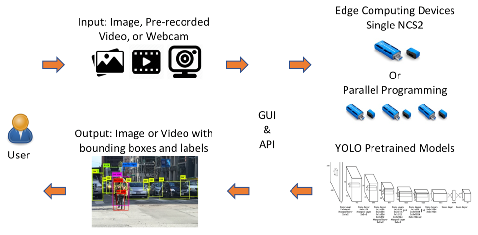

## Introduction
This project aims at accelerating deep neural networks on the edge using Intel Neural Compute Stick 2 (NCS). We show that NCSs are capable of speeding up the inference time of complicated neural networks to be efficient enough to run locally on edge devices. Such acceleration paves the way to develop ensemble learning on the edge for performance improvement. As a motivating example, we exploit object detection to be the application and utilize the well-known algorithm YOLOv3 as the objector. 

We further develop a web-based visualization platform to support object detection on (1) photo, (2) video, and (3) webcam and display the frame per second (FPS) to indicate the speed up using one or multiple NCSs running in parallel. The architecture of the system is as below.



## Demo
We provide a demo video below to show the basic usage of this project. You may run the source code to replicate the demo using NCS devices.

[](http://www.youtube.com/watch?v=-qs5oX4c-qU "Demo")


## Installation
This project consists of two components: (1) client-side for detection visualization and (2) server-side hosting the Intel Compute Sticks for object detection. You should follow the instruction carefully to start each component. This following instruction assumes that you have already installed OpenVINO according to the guideline provided by Intel to run NCS on your machine.
### Client

The client is a React app. The UI allows three types of inputs - image, video and webcam stream. If the input is an image, it is converted to a base64 encoded string and sent to server. The server decodes the image and runs the detection algorithm on it. Server then sends back the prediction results - class, score and bounding box locations - which are then displayed on the UI. For video or video stream captured through UI, the workflow is same, except that in this case, each frame of the video is encoded as base64 string and sent to server.

To run the client, follow the below steps

> cd app/

> npm install

> npm start

The client runs on port 3000.

### Server

The server is a simple Flask server.


To run the server:
1. Install Flask with `pip install Flask`
2. Setup OpenVINO env as instructed by Intel
3. Run `python3 server_parallel.py`
4. Plugin the device one by one according to the instruction


The server supports two APIs

1. POST /detect_objects 
	
	This API is used to send the image data to the server.

	URL: `http://{device ip}:5000/detect_objects`

	request body:
	```json
	{ 
	    "image": "Base 64 encoded image, as a string",
	    "mode": "“parallel” or “ensemble”",
	    "models": "one or more model names, as an array"
	}
	```
	
	The server accepts the request data and immediately responds with 200 response code. The data is processed asynchronously and the prediction results are stored in the server until requested by the client. 

2. GET /detect_objects_response
	
	This API is used to retrieve the prediction results from the server. The client repeatedly polls the server with this API until a response is given.
	
	URL: `http://{device ip}:5000/detect_objects_response?models=<model names>`

	Response:

	with 'mode' == 'parallel'
	```Json
	{
	    "model1": [
		{
		    "bbox": [
			1,
			0,
			200,
			200
		    ],
		    "class": "person",
		    "score": 0.838
		}
	    ],
	    "model2": [
		{
		    "bbox": [
			1,
			0,
			200,
			200
		    ],
		    "class": "person",
		    "score": 0.838
		}
	    ],
	    "model3": [
		{
		    "bbox": [
			1,
			0,
			200,
			200
		    ],
		    "class": "person",
		    "score": 0.838
		}
	    ]
	}
	```

	with 'mode' == 'ensemble'
	```Json
	{
	    "all": [
		{
		    "bbox": [
			1,
			0,
			200,
			200
		    ],
		    "class": "person",
		    "score": 0.838
		}
	    ]
	}
	```

## Supported Platforms

The dependencies of this project have been listed in `requirements.txt`. The current version of this project is tested on the following platform:
* Operating System: Ubuntu 18.04.3 LTS
* Python Version: Python 3.6.8
* Web Browser: Firefox

## Status
We are continuing the development of this project and there is ongoing work in our lab regarding deep learning on the edge.

This project is developed based on two repositories:
* PINTO0309/OpenVINO-YoloV3: https://github.com/PINTO0309/OpenVINO-YoloV3
* opencv/open_model_zoo: https://github.com/opencv/open_model_zoo

## Contributors
This project is managed and maintained by [Ka-Ho Chow](https://khchow.com).

* [Ka-Ho Chow](https://khchow.com): khchow@gatech.edu
* [Quang Huynh](https://www.linkedin.com/in/hvquang/)
* Sonia Mathew
* Hung-Yi Li
* Yu-Lin Chung

Contributions are welcomed! Please contact [Ka-Ho Chow](https://khchow.com) (khchow@gatech.edu) if you have any problem.
